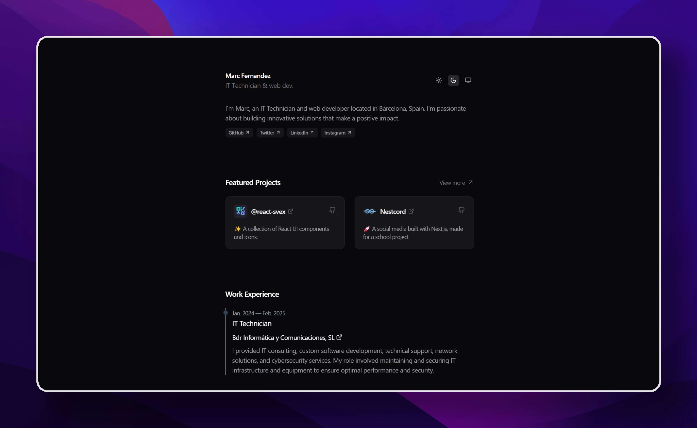

<div align="center">
<a href="https://marcfernandez.dev">

</a>
</div>

<div align="center">
    <a href="https://marcfernandez.dev" target="_blank">
        Personal Site
    </a>
    <span>&nbsp;❖&nbsp;</span>
    <a href="https://www.linkedin.com/in/marcfernandezo">
        LinkedIn
    </a>
    <span>&nbsp;❖&nbsp;</span>
    <a href="https://x.com/marcfernandezo1">
        X (formerly Twitter)
    </a>
</div>

## 🚀 Contributing

Any contributions you make are **greatly appreciated**.

1. [Fork](https://github.com/marcfernandezo/marcfernandez.dev/fork) this repository.
2. Install dependencies:

```bash
# You should have pnpm installed:
npm install -g pnpm

# Then:
pnpm install
```

3. Start the development server:

```bash
pnpm dev
```

## 📝 License

- Apache License 2.0
